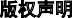

EU-GDPR和个人信息保护法（草案）

如何在《欧盟通用数据保护条例》（EU-GDPR）合规环境下看待《中华人民共和国个人信息保护法（草案）》

摘要

目前，我国网络安全和信息安全管理体制处于“齐抓共管”的状况，因此法出多门的现象屡见不鲜。2020年10月13日经第十三届全国人大常委第二十二次会议初审的《中华人民共和国个人信息保护法（草案）》（以下简称“个人信息保护法（草案）”）将会改变我国个人信息保护法律规范体系的当前局面。

EU-GDPR合规的国内企业和欧盟成员国企业中国分公司均需要了解并适应持续变化的中国个人信息保护法律规范体系。

本白皮书阐述了欧盟通用数据保护条例（EU-GDPR）和个人信息保护法（草案）的相同点和不同点。

# 目录

目录 [2](#目录)

前言 [3](#前言)

[EU-GDPR前言第47条：合法利益](#eu-gdpr前言第47条合法利益)

【个人信息保护法（草案）对标】 [5](#_bookmark2)

[EU-GDPR前言第50条：进一步处理](#eu-gdpr前言第50条进一步处理)

【个人信息保护法（草案）对标】 [5](#_bookmark2)

[EU-GDPR第1章：一般条款第3条：外国公司扩展赔偿责任](#eu-gdpr第1章一般条款第3条外国公司扩展赔偿责任)

【个人信息保护法（草案）对标】 [5](#_bookmark2)

[EU-GDPR第2章：原则第5、6、7条：有关个人数据处理](#eu-gdpr第2章原则第567条有关个人数据处理)

【个人信息保护法（草案）对标】 [6](#_bookmark3)

[EU-GDPR第2章：原则第8条：有关儿童信息的同意条件](#eu-gdpr第2章原则第8条有关儿童信息的同意条件)

【个人信息保护法（草案）对标】 [6](#_bookmark3)

[EU-GDPR第3章：数据主体权利 第12、13、14条：透明度和信息保密义务](#eu-gdpr第3章数据主体权利-第121314条透明度和信息保密义务)

【个人信息保护法（草案）对标】 [6](#_bookmark3)

[EU-GDPR第3章：数据主体的权利第17条：删除权 （“遗忘权”）](#eu-gdpr第3章数据主体的权利第17条删除权遗忘权)

【个人信息保护法（草案）对标】 [7](#_bookmark4)

[EU-GDPR第3章：数据主体的权利第20条：数据可携带权](#eu-gdpr第3章数据主体的权利第20条数据可携带权)

【个人信息保护法（草案）对标】 [7](#_bookmark4)

[EU-GDPR第3章：数据主体的权利第22条：概况分析](#eu-gdpr第3章数据主体的权利第22条概况分析)

【个人信息保护法（草案）对标】 [7](#_bookmark4)

[EU-GDPR第4章：控制者与处理者第24条：负责处理的控制者的职责](#eu-gdpr第4章控制者与处理者第24条负责处理的控制者的职责)

【个人信息保护法（草案）对标】 [7](#_bookmark4)

[EU-GDPR第4章：控制者与处理者第25条：默认数据保护](#eu-gdpr第4章控制者与处理者第25条默认数据保护)

【个人信息保护法（草案）对标】 [8](#_bookmark5)

EU-GDPR第4章：控制者与处理者第26条：联合控制者及第28条：处理者

【个人信息保护法（草案）对标】 [8](#_bookmark5)

[EU-GDPR第4章：控制者与处理者第32条：处理安全](#eu-gdpr第4章控制者与处理者第32条处理安全)

【个人信息保护法（草案）对标】 [8](#_bookmark5)

[EU-GDPR第4章：控制者与处理者第33条：通知侵犯数据保护的义务](#eu-gdpr第4章控制者与处理者第33条通知侵犯数据保护的义务)

【个人信息保护法（草案）对标】 [9](#_bookmark6)

[EU-GDPR第4章：控制者与处理者第35条：数据保护影响评估](#eu-gdpr第4章控制者与处理者第35条数据保护影响评估)

【个人信息保护法（草案）对标】 [9](#_bookmark6)

[EU-GDPR第4章：控制者与处理者第37、38、39条：数据保护官的职能和义务](#eu-gdpr第4章控制者与处理者第373839条数据保护官的职能和义务)

【个人信息保护法（草案）对标】 [9](#_bookmark6)

[EU-GDPR第4章：控制者与处理者第42条：认证](#eu-gdpr第4章控制者与处理者第42条认证)

【个人信息保护法（草案）对标】 [10](#_bookmark7)

[EU-GDPR第5章：个人数据传输到第三国或者国际组织第44、45、46、47、48、49、50条：国际数据传输](#eu-gdpr第5章个人数据传输到第三国或者国际组织第4445-4647484950条国际数据传输)

【个人信息保护法（草案）对标】 [10](#_bookmark7)

[EU-GDPR第8章：救济、责任与惩罚第82条：赔偿责任和赔偿权](#eu-gdpr第8章救济责任与惩罚第82条赔偿责任和赔偿权)

【个人信息保护法（草案）对标】 [10](#_bookmark7)

[EU-GDPR第8章：救济、责任与惩罚第83、84条：行政处罚和制裁](#eu-gdpr第8章救济责任与惩罚第8384条行政处罚和制裁)

【个人信息保护法（草案）对标】 [10](#_bookmark7)

结论 [11](#结论)

TÜV南德意志集团专家介绍

张书源先生是TÜV南德意志集团网络安全服务部的数据保护主管及CISA持证人。他曾担任某网络安全服务公司高级审计师，为金融、广告、奢侈品和消费品制造等行业提供数字取证和中国网络安全法合规咨询服务。现负责为某知名电子消费品企业提供数据保护服务。

# 前言

目前，我国网络安全和信息安全管理体制处于“齐抓共管”的状况，因此法出多门的现象屡见不鲜，已形成了非常复杂的个人保护信息法律体系，从法律层面（《网络安全法》、《民法典》、《电子商务 法》、《旅游法》、《护照法》、

《社会保险法》）到行政法规层面

（《电信条例》、《互联网信息服务管理办法》、《征信业管理条 例》）均已经加入对个人信息保护的要求和原则。司法解释体系的

《最高人民法院关于审理利用信息网络侵害人身权益民事纠纷案件适用法律若干问题的规定》和《最高人民法院、最高人民检察院、公安部关于办理电信网络欺骗等刑事案件适用法律若干问题的意见》同时明确入罪范围和量刑标准。

近期通过初审的《个人信息保护法

（草案）》是首部专用于保障个人信息安全的上位法，其最大特点是最大幅度提高了个人信息泄露的违法成本，以此打击数据黑产。相信在不久的将来，个人信息保护法会成为公民用来保护个人信息的“利剑”。个人信息保护法（草案）正式颁布后，其意义相当于欧盟的

《通用数据保护条例》（EU-GDPR）及美国的《加州消费者隐私法》。我国的个人信息保护法（草案） 和欧盟的《通用数据保护条例》

（EU-GDPR）及美国的《加州消费者隐私法》（CCPA）一样，将采取严厉的行政处罚制度来遏制侵犯个人信息的违法行为，草案明确规

定罚款上限可达5000万或者上一年度营业额的5%。

借用新华网近期报道的一篇关于涉及个人信息违法行为的文章标题——彻底断了倒卖个人信息的“毒瓜秧”，可见我国对个人信息保护问题极其重视。然而作为企业负责人和管理人员，则会担心企业运营成本因此水涨船高，刚花了大量时间和精 力使企业内外部流程符合EU-GDPR

的要求，现在又得考虑到如何落 地个人信息保护法（草案）中的要求。TÜV南德意志集团的专家将 EU-GDPR中的关键原则和规则（图表1）与个人信息保护法（草案）中内容进行比较和解读，希望可以帮助EU-GDPR合规的企业了解个人信息保护法（草案）的关键信息，减少重复性的工作。

| 欧盟通用数据保护条例（EU-GDPR）                                                             | 中国个人信息保护法（草案）对标 |
|---------------------------------------------------------------------------------------------|--------------------------------|
| EU-GDPR前言第47条：合法利益                                                                 | 无匹配，见专家解读             |
| EU-GDPR前言第50条：进一步处理                                                               | 无匹配，见专家解读             |
| EU-GDPR第1章： 一般条款第3条：外国公司扩展赔偿责任                                          | 草案第3、52条                  |
| EU-GDPR第2章：原则第5、6、7条：有关个人数据处理                                             | 草案第8、13条                  |
| EU-GDPR第2章： 原则第8条：有关儿童信息的同意条件                                            | 草案第15条                     |
| EU-GDPR第3章：数据主体权利 第12、13、14条：透明度和信息保密义务                             | 草案第18条                     |
| EU-GDPR第3章：数据主体的权利第17条：删除权（“遗忘权”）                                      | 草案第47条                     |
| EU-GDPR第3章：数据主体的权利第20条：数据可携带权                                            | 无匹配                         |
| EU-GDPR第3章：数据主体的权利第22条：概况分析                                                | 草案第25条                     |
| EU-GDPR第4章：控制者与处理者第24条：负责处理的控制者的职责                                  | 草案第9条                      |
| EU-GDPR第4章：控制者与处理者第25条：默认数据保护                                            | 无匹配，见专家解读             |
| EU-GDPR第4章：控制者与处理者第26条：联合控制者，第28条：处理者                              | 无匹配，见专家解读             |
| EU-GDPR第4章：控制者与处理者第32条：处理安全                                                | 草案第50条                     |
| EU-GDPR第4章：控制者与处理者第33条：通知侵犯数据保护的义务                                  | 草案第55条                     |
| EU-GDPR第4章：控制者与处理者第35条：数据保护影响评估                                        | 无匹配，见专家解读             |
| EU-GDPR第4章：控制者与处理者第37、38、39条：数据保护官的职能和 义务                         | 无匹配，见专家解读             |
| EU-GDPR第4章：控制者与处理者第42条：认证                                                    | 无匹配，见专家解读             |
| EU-GDPR第5章：个人数据传输到第三国或者国际组织第44、45、46、47、 48、49、50条：国际数据传输 | 草案第38、39、40、41、42、43条 |
| EU-GDPR第8章：救济、责任与惩罚第82条：赔偿责任和赔偿权                                      | 草案第65条                     |
| EU-GDPR第8章：救济、责任与惩罚第83、84条：行政处罚和制裁                                    | 草案第4章                      |

图表1

## EU-GDPR前言第47条：合法利益

EU-GDPR追求公司的合法利益与数据主体的利益及其基本权利之间的利益平衡。EU-GDPR前言部分中注明：以直接营销为目的处理个人数据应被视为公司的合法权益。

【个人信息保护法（草案）对标】

EU-GDPR的前言（Recital）独立出

一个章节来讲合法利益（前言第47条），可以依据“合法权益”来处理数据。 其中包括邮件营销这一线上广告营销行为。个人信息保护法（草案）没有对应的章节和说明，但是在个人信息保护法

（草案）第25条提及了关于“通过自动化决策方式进行的商业营销

和信息推送” 。纵观当下的线上广告营销活动，均是基于自动化决策，例如基于大数据的用户画像建模。EU-GDPR和个人信息保护法

（草案）均要求这些新技术是透明且公平合理的。

## EU-GDPR前言第50条：进一步处理

EU-GDPR引入了目的限制的概念。该条例对初始处理和进一步处理进行了明确区分。鉴于这种区别，只有最初明确了数据收集背后隐藏目的和合法目的一致的情况下，才允许对数据作出进一步处理。这又称为“兼容性验证”，因为必须明确初始处理的初始目的是否与进一步处理的目的兼容。

条注明“接收方变更原先的处理目的、处理方式的，应当依照本法规定

重新向个人告知并取得其同意”。

EU-GDPR要求确保初始处理和个人数据的进一步处理都具备明确的合法目的。个人信息保护法（草案）中没有这层设计，但是在第23

## EU-GDPR第1章：一般条款第3条：外国公司扩展赔偿责任

EU-GDPR适用对象涵盖外国企业，即使这些企业在欧盟成员国没有设立子公司（所谓的lex loci solutionis或履行地法律）。此种责任范围 延伸到所有能够为欧盟公民提供商品或服务的数据处理活动，不论这种情况是否存在于欧盟范围内，均应遵守行为规范。因此，不仅

Facebook和谷歌等公司需要遵守行为规范，每个通过应用欧盟语言、或通过促进欧元支付为欧盟公民提供商品或服务的供应商也需要遵守行为规范。

【个人信息保护法（草案）对标】个人信息保护法（草案）可以看到

和EU-GDPR类似的长臂管辖方案，第3条明确了境内和境外处理自然人个人信息活动均需要遵守个人信息保护法。同时，第52条提出需在中国境内设立专门机构或指定代表负责处理个人信息保护相关事务的要求。

## EU-GDPR第2章：原则第5、6、7条：有关个人数据处理

个人数据处理只有满足至少如下一项条件时才视为合法：

（一）数据主体已经同意基于一项或多项目的而对其个人数据进行 处理；

（二）需要根据合同（或合同前措施）进行处理，存在法律依据，或者根据控制者或第三方的合法利益处理个人数据。在这种情况下，数据处理可能并非以第三国的法律作为基础。

（三）必须是自愿同意，并且必须采用易于理解的形式，包括简单的语言在内。

（四）不明确要求获得书面同意。但是由于必须保留批准文件，因此建议获得。

（五）数据主体有权在任何时候撤销同意。撤销流程必须与授予流程一样简单。

（六）合同授予或服务的提供可以

不需要获得数据主体的同意，除非为了符合合同规定，则要求获得数据处理的主体的同意。

【个人信息保护法（草案）对标】对应个人信息保护法（草案）第8条

—— 为实现处理目的，所处理的个人信息应当准确，并及时更新。

第13条 —— 只有在满足指定的情形下，如明确了个人信息的合法性基础，个人信息处理者才能处理个人信息。另外，在个人信息保护法

（草案）中提到了“单独同意”,这是比EU-GDPR中的“自愿、明确同意”更高的标准。“单独同意”需要场景来触发。

## EU-GDPR第2章：原则第8条：有关儿童信息的同意条件

根据EU-GDPR规定，有关儿童个人数据的处理仅在儿童年满16岁或具有父母监护责任的主体同意或授权进行数据处理的情况下才合法。

【个人信息保护法（草案）对标】草案第15条 —— 个人信息处理者知道或者应当知道其处理的个人信息为不满十四周岁未成年人个人信

息的，应当取得其监护人的同意。本条和EU-GDPR的第8条内容相近，但是儿童的年龄标准定义为不满十四周岁。

## EU-GDPR第3章：数据主体权利 第12、13、14条：透明度和信息保密义务

通过数据主体收集个人数据时， EU-GDPR进一步强化了提供信息的义务。除了众所周知的提供信息义务，如控制者的身份以及接收者的目的和类别以外，目前还需要提供以下信息：

-   控制者及其代表接触的数据。
-   数据保护官接触的数据。
-   控制者的合法利益。
-   将数据传输到第三国或国际组织的意图（以及委员会的相关充分性决定）。
-   数据储存时间。
-   数据主体获取信息，删除、更 正、限制撤销同意的权利，向监管机构提出上诉的权利等。
-   任何概况分析背后隐藏的原因和后果。

    【个人信息保护法（草案）对标】第18条有着相近的要求，例如要求处理个人信息前要告知个人信息处理者的身份和联系方式。同时告知处理目的，处理方式，信息的种类及保存期限等需要透明公开的信息。需告知事项发现变更的，应当将变更部分告知数据主体。

## EU-GDPR第3章：数据主体的权利第17条：删除权（“遗忘权”）

如果记录的目的不再适用，则必须删除个人数据，但前提是没有其他法律依据可以证明进一步处理的合理性。另外还有一项特殊义务，规定必须删除与儿童（16岁或16岁以下）有关的个人资料。此外，公司

必须在个人数据被“公开”的情况下采取特殊行动。根据现有技术和采取适当措施的成本，公司必须将数据主体要求删除所有链接、副本和数据复制的需求告知其他公司。

【个人信息保护法（草案）对标】草案第47条明确规定：按照指定的情形，个人信息处理者应当主动或者根据个人的请求，删除个人信息。

## EU-GDPR第3章：数据主体的权利第20条：数据可携带权

EU-GDPR要求控制者能够以结构化、通用的和机器可读的个人数据形态返还数据主体已提供给控制者的信息。如果技术可行，数据主体有权

将这些数据从一个控制者直接传输到另一个控制者。这标志着欧洲公司中的异构公司特定数据格式的终结，至少在纸面上是如此。

【个人信息保护法（草案）对标】个人信息保护法（草案）中没有对应EU-GDPR数据可携带权的设计。

## EU-GDPR第3章：数据主体的权利第22条：概况分析

EU-GDPR引入了“概况分析”的概念。分析应被理解为任何类型的自动化处理，目的是利用数据评估、分析或预测数据主体的某些个人方面信息。

【个人信息保护法（草案）对标】草案第25条同样对个人信息用于自

动化决策进行了条件限制。第25条规定利用个人信息进行自动化决 策，应当保证决策的透明度和处理结果的公平合理。个人认为自动化决策对其权益造成重大影响的，有权要求个人信息处理者予以说明，并有权拒绝个人信息处理者仅通过自动化决策的方式作出决定。通过

自动化决策方式进行商业营销、信息推送，应当同时提供不针对其个人特征的选项。

## EU-GDPR第4章：控制者与处理者第24条：负责处理的控制者的职责

负责处理数据的控制者需要采取适当的技术和组织措施，以确保个人数据的处理符合EU-GDPR规定。在这种情况下，必须审查技术和组织措施，并酌情予以更新。负责处理工作的控制者必须事先确定个人权利和自由等风险问题的可能性和严

重性。此外，他们必须提供证据证明个人数据的处理符合规范要求。因此，需要进行（书面）风险评 估，基于客观评估数据处理所面临的风险以及相关风险的高低程度。作为评估的一部分，原因、可能性和严重性可以作为标准予以应用。

【个人信息保护法（草案）对标】个人信息保护法（草案）第9条——个人信息处理者应当对其个人信息处理活动负责，并采取必要措施保障所处理的个人信息的安全。该条款与EU-GDPR第24条的内容近似，但没有其详细。

## EU-GDPR第4章：控制者与处理者第25条：默认数据保护

公司必须默认实施数据保护。无论是在概念阶段还是在数据处理过程中，都必须采取技术和组织措施，原则上，通过适当的预先设置，只处理需要处理的数据。这项义务适用于所记录的个人数据的数量、处理

的程度、存储的期限及其可访问性。

【个人信息保护法（草案）对标】个人信息保护法（草案）中没有默认数据保护的概念。第50条明确了个人信息处理者的安全保护义务，

按照风险等级采取必要措施保护个人信息处理活动符合法律、行政法规的规定，并防止未经授权的访问及个人信息泄露或者被窃取、篡改、删除。

## EU-GDPR第4章：控制者与处理者第26条：联合控制者及第28

条：处理者

具体要求适用于代表控制者所进 行处理的情况。此外，EU-GDPR提供了共同控制者的“新形式”合作。根据EU-GDPR规定，两个或更多控制者可以联合合作，条件是已经协商确定了合作的目的和处理方式。协议形式必须透明，并提供有关不同职能责任的明确信息。 重要的是，此要求包括数据量、处理范围、存储时间和可访问性。

【个人信息保护法（草案）对标】个人信息保护法（草案）没有区分数据控制者和数据处理者，而是统称为个人信息处理者。另外将除个人信息处理者以外的称为第三方。虽然没有借鉴EU-GDPR的角色二元定义方法， 承担的责任仍然需要明确。个人信息保护法（草案）第 21条规定两个或者两个以上的个人信息处理者共同决定个人信息的处

理目的和处理方式的，应当约定各自的权利和义务。但是，该约定不影响个人向其中任何一个个人信息处理者要求行使本法规定的权利。个人信息处理者共同处理个人信 息，侵害个人信息权益的，依法承担连带责任。

## EU-GDPR第4章：控制者与处理者第32条：处理安全

EU-GDPR基于风险的方法要求公司采取适当的技术和组织措施，以确保能够应对风险的保护水平。在这种情况下，不仅需要考虑技术状 态、实施成本，还需要考虑处理的性质、范围、情况和目的，以及风险的可能性和数据主体权利风险的严重性。同时明确要求采用假名化和加密技术。此外，必须采取措施保证系统的机密性、完整性、可访问性和适应性。公司不仅需要确保

在发生物理或技术事件时快速恢复数据访问，还需要建立流程，以便定期评估现有技术和组织措施的有效性。

【个人信息保护法（草案）对标】个人信息保护法（草案）第50条有近似的要求且更具体：

（一）制定内部管理制度和操作规程；

（二）对个人信息实行分级分类

管理；

（三）采取相应的加密、去标识化等安全技术措施；

（四）合理确定个人信息处理的操作权限，并定期对从业人员进行安全教育和培训；

（五）制定并组织实施个人信息安全事件应急预案；

（六）法律、行政法规规定的其他措施。

## EU-GDPR第4章：控制者与处理者第33条：通知侵犯数据保护的义务

如果个人数据受到侵犯，则有义务通知数据主体，以及其权利和自由可能面临的高风险。必须及时以明确、简洁的语言立即通知数据主体。

【个人信息保护法（草案）对标】个人信息保护法（草案）中存在对应项，第55条规定个人信息处理者发现个人信息泄露的，应当立即采

取补救措施，并通知履行个人信息保护责任的部门和个人。

## EU-GDPR第4章：控制者与处理者第35条：数据保护影响评估

进行数据保护影响评估的义务适用于所有数据处理和数据处理的整个生命周期。尤其适用于使用新技 术进行处理的情况，由于处理的性质、范围、语境和目的，可能会对数据主体的个人权利和自由造成极高风险。数据保护影响评估需要系统地描述计划的处理步骤和处理目

的，包括适用于公司追求的合法利益（例如：邮件营销活动），评估处理步骤与目的有关的必要性和相称性，以及评估数据主体权利和自由带来的风险。

【个人信息保护法（草案）对标】个人信息保护法（草案）同样要求

个人信息处理者在个人信息处理活动前进行风险评估。第50条要求个人信息处理者应当对指定的个人信息处理活动在事前进行风险评估，并对处理情况进行记录，且明确了风险评估的内容。风险评估报告和处理情况记录应当至少保存三年。

## EU-GDPR第4章：控制者与处理者第37、38、39条：数据保护官的职能和义务

除少数例外情况外，EU-GDPR允许成员国决定私营企业是否需要任命数据保护官。数据保护官员不接受指导，可以不被召回或受到不利因素的干扰，必须直接向最高管理层报告。其工作职责包括公司内部培训和提供建议。他们有义务监督遵守 EU-GDPR规定，以及其他数据保护法规和公司战略，包括责任分配。

【个人信息保护法（草案）对标】个人信息保护法（草案）没有数据保护官这一概念，而是定义了个人信息保护负责人的角色。第51条：处理个人信息达到国家网信部门规定数量的个人信息处理者应当指定个人信息保护负责人，负责对个人信息处理活动以及采取的保护措施等进行监督。个人信息处理者应当

公开个人信息保护负责人的姓名、联系方式等，并报送履行个人信息保护职责的部门。草案中关于个人信息保护负责人的解读比较笼统，没有EU-GDPR中对数据保护官角色解读得详细。

## EU-GDPR第4章：控制者与处理者第42条：认证

通过EU-GDPR认证越来越重要，因为它可以证明符合相关规范要求。经认可的认证机构或负责的监督机构评估，将根据已批准的准则授予认证。

【个人信息保护法（草案）对标】个人信息保护法（草案）明确了推进个人信息保护社会化服务体系建设。TÜV南德意志集团EU-GDPR专家认为个人信息保护评估服务将会

成为新的产业，发展前景巨大。

## EU-GDPR第5章：个人数据传输到第三国或者国际组织第44、45、 46、47、48、49、50条：国际数据传输

如果第三国或者国际组织已经经过欧盟委员会确认，证明其提供了充分的数据保护，则可以在未经特别许可的情况下传输数据。如果保护级别不够，则可以采用众所周知的方式，例如标准合同条款，具有约束力的公司条例或数据主体的同意。

特别是在具有约束力的公司条例方面，备受认可的相关前提条件现已列入EU-GDPR。

【个人信息保护法（草案）对标】个人信息保护法（草案）的第3章

（第38、39、40、41、42、43条）

明确了个人信息跨境提供的规则，覆盖了个人信息处理者的条件，告知形式，非普通个人信息处理者的额外条件，基于司法、行政的传输审批要求，清单制度及个人信息保护方面对等反制措施。

## EU-GDPR第8章：救济、责任与惩罚第82条：赔偿责任和赔偿权

EU-GDPR规定了每家公司的责任，并且规定即使在非物质性伤害的情况下也有义务提供赔偿。除了调查所造成的实际损害之外，还可能调

查数据处理本身的合规性。这样，每家公司面临的潜在责任风险也会增加。

【个人信息保护法（草案）对标】与EU-GDPR法案类似，个人信息保护法（草案）第65条规定违法获利者需要承担赔偿责任。

## EU-GDPR第8章：救济、责任与惩罚第83、84条：行政处罚和制裁

根据违法行为的严重程度，EU-GDPR概述的经济处罚标准从1,000万欧元到2,000万欧元不等；如果是公司，则不超过前一年度在全球范围内实现的总销售额的2%至4%。

【个人信息保护法（草案）对标】个人信息保护法（草案）第7章法律责任中对违法行为情节严重的，由履行个人信息保护职责的部门 责令改正，没收违法所得，并处人民币5,000万元以下或者上一年度营业额5%以下罚款，并可以责令暂

停相关业务、停业整顿、通报有关主管部门吊销相关业务许可或者吊销营业执照；对直接负责的主管人员和其他直接责任人员处十万元 以上一百万元以下罚款。相较于

EU-GDPR，本草案的法律责任更全面，包括了经济处罚和行政手段。

# 结论

个人信息保护法（草案）刚刚发 布， 部分条款需要有关部门进一步解读和优化，但是作为上位法，其内容已经非常详细。在正式立法后，配套的可实施细节也会逐步出台和完善。除个人信息保护法

（草案）外，《区域全面经济伙伴关系协定（RCEP）》的签署更值得关注。东盟10国和中国、日本、

韩国、澳大利亚、新西兰历经8年的谈判，组建了全球最大的自由贸易区，为疫情下全球经济增长注入活力。我们关注机遇的时候，也要关注其中不确定的变化。《区域全面经济伙伴关系协定》使用一个独立的章节谈电子商务（第12）章，可见对数据经济贸易的重视。该章节中第8条是线上个人信息保护，

要求缔约方的个人信息保护规则能互相兼容，然而在缔约方中，澳大利亚、日本、韩国、越南、新加坡和中国均立有各自的个人信息保护法案，因此这项条款十分具有挑战性。TÜV南德意志集团将对其进行持续关注并帮助企业合规盈利。

版权声明

本文件所载信息为TÜV南德意志集团（以下简称“TÜV南德”）目前对截至出版之日所讨论问题之看法。由于TÜV南德必须对不断变化的市场条件作出反应，因此不应将其理解为TÜV南德作出的承诺，TÜV南德不能保证在出版日期之后所提供的任何信息的准确性。本白皮书内容仅供参考。TÜV南德不对本文件中的信息作任何明示、暗示或法定的保证。用户有责任遵守所有现行的版权法规。在不限制版权的情况下，未经TÜV南德明确书面许可，不得以任何形式或手段

（电子、机械、影印、记录等）或出于任何目的，对本文件中任何部分进行复制、存储或导入检索系统进行传递。

TÜV南德拥有本文件中涉及题材的专利、专利申请、商标、版权或其他知识产权。除非TÜV南德在书面许可协议中明确规定，否则提供本文件并不表示授予您任何专利、商标、版权或其他知识产权。除版权法许可外，未经事先书面许可，不得复制、改编、翻译本文档。© TÜV南德意志集团——2020年——版权所有——TÜV SÜD是TÜV南德意志集团的注册商标。

免责声明

我们已采取一切合理措施确保本文中信息的质量、可靠性和准确性。但是，TÜV南德意志集团（以下简称“TÜV南德”）不对本出版物中包含的第三方内容负责。TÜV南德对本出版物中包含的信息的准确性或完整性不作任何明示或暗示的保证或声明。本出版物旨在提供关于一个或多个特定主题的一般信息，并非对这些主题的详尽论述。因此，本出版物中的信息不构成咨询或专业意见或服务。如果您就本出版物内与资讯有关的事宜征询意见，请您在适当情况下直接与我们联络咨询具体事宜，或向合格的专业人士征询意见。未经TÜV南德事先书面同意，本出版物中包含的信息不得在任何其他出版物或材料中复制、引用或提述。保留所有权利 © 2020TÜV南德意志集团。

欲在大中华区获得EU-GDPR专家一站式服务，请与我们联系：

[**www.tuvsud.cn**](http://www.tuvsud.cn/) [**info.cn@tuvsud.com**](mailto:info.cn@tuvsud.com)

创享价值，激发信任

作为一家安全、可靠和可持续发展解决方案等方面值得信赖的合作伙伴，TÜV南德意志集团提供测试、认证、审核及知识服务。自1866年以来，集团始终致力于通过保护人类、环境和资产免受相关技术风险的影响。公司在全球设立了1,000多个分支机构，并拥有超过25,000名员工，通过实现市场准入和控制风险，TÜV南德意志集团激发对现实和数字世界的信任，以创造更安全、更可持续发展的未来。

TÜV南德意志大中华集团

上海市恒通路151号3-13层 200070

\+86 21 6141 0123

[info.cn@tuvsud.com](mailto:info.cn@tuvsud.com) [www.tuvsud.cn](http://www.tuvsud.cn/)
